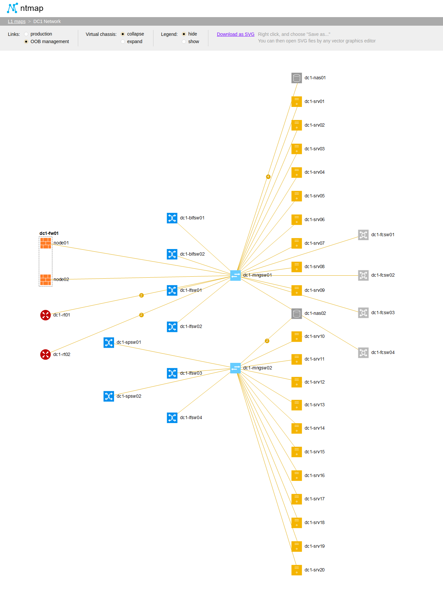

# Ntmap - Network Topology Map

Ntmap is a tool to visualize network topologies using [Netbox](https://github.com/netbox-community/netbox) as a data source.


## Installation

Please, see the [installation guide](installation.md) for help installing Ntmap.


## Usage

### Start using Ntmap

The usage of Ntmap is very simple. You can have several (or many) network topology maps. All maps are organized in groups for better structurization.

To edit groups of maps or maps themselves just click **lock** symbol on the "L1 maps" page. You will enter edit mode. Add needed groups and maps.

To define a map give it a name and describe devices and providers you want to display in the "Scheme" field. Example:
```
Provider
dc1-rt, dc1-fw
dc1-spsw
dc1-blfsw, dc1-lfsw
dc1-mngsw
dc1-srv, dc1-nas
dc1-
```

Ntmap will search Netbox database for given name patterns and will display found devices and providers on map. Each line of the scheme represents a level at which a found device or provider will be displayed on the final graph.

The example scheme above can generate a network graph for production links like this:


And a network graph for management links like this:



**Note:** link is considered to be a management link when at least one of the interfaces forming the link is marked as "OOB Management" in Netbox.


### Changing Ntmap Settings

#### New Icons

You can add your own icons to Ntmap graphs. To do this, you need to create new SVG-images with dimensions 32 x 32 pixels in ```www/img``` directory and list them in DEVICE_ROLES variable in file ```settings.js```.

For example, 
```
var DEVICE_ROLES = {
	"Router":   "router.svg",
	"Firewall": "firewall.svg",
	"Unknown":  "unknown.svg"
}
```
defines that all devices with role "Router" found in Netbox will be depicted by **router.svg** and all firewalls will be shown as **firewall.svg**. All other devices will be shown as **unknown.svg** (question mark icon).


#### Maximum Objects at One  Level

You can limit the maximum number of objects (devices, providers and circuits) depicted at one level of your maps. This is relevant when you want to prevent Ntmap consuming too much CPU and memory of your machine. Large maps can be resourse-demanding.

To do this change **max_objects_at_one_level** variable in ```settings.ini```. For changes to take effect, you need to restart Ntmap service.
